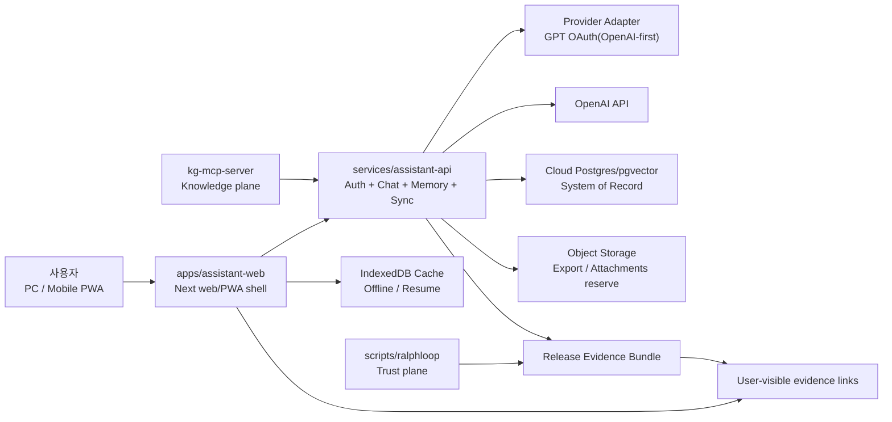

# S02 System Architecture

## 1. 목적

`S01 Product Brief`에서 고정한 제품 범위를 깨지 않으면서, 현재 저장소의 강점인 `KG MCP`와 `Ralph Loop`를 사용자용 비서 앱 구조에 어떻게 연결할지 결정하는 문서다.

이번 세션의 핵심 결론은 아래 4가지다.

1. 사용자 런타임과 품질 엔진을 분리한다.
2. 사용자 런타임의 단일 백엔드는 `assistant-api`가 맡는다.
3. `KG MCP`와 `Ralph Loop`는 사용자 요청의 필수 경로가 아니라 지원 평면으로 둔다.
4. 저장소는 분리하지 않고 현재 레포 안에서 인플레이스 확장한다.

## 2. 현재 기반 구조

현재 저장소에는 이미 강한 기반이 두 개 있다.

| 축 | 현재 자산 | 현재 역할 | S02에서의 해석 |
|---|---|---|---|
| Knowledge plane | `kg-mcp-server/mcp_server/server.py`, `pipeline/*`, `tools/*` | 코드/지식 그래프 검색, MCP 도구 제공, 관측 데이터 수집 | 사용자 제품의 직접 백엔드가 아니라 개발/운영 보조 인프라 |
| Trust plane | `scripts/ralphloop/loop_runner.py`, `run.py`, `self_review.py`, `e2e/*` | 스캔, 점수 계산, E2E, 액션플랜 생성 | 사용자 앱 품질을 증거로 검증하는 엔진 |
| Distribution plane | `skills/*`, `README.md`, 설치 스크립트 | 오픈소스 패키징과 배포 | 이후 앱과 품질 엔진을 함께 배포하는 표면 |

반대로 아직 없는 것은 아래 두 축이다.

1. 비개발자용 사용자 앱 표면
2. 인증, 메모리, 세션, 동기화를 담당하는 제품 백엔드

## 3. 목표 아키텍처



### 해석

1. 사용자는 `assistant-web`만 본다.
2. 모든 사용자 인증, 세션, 메모리, 동기화 책임은 `assistant-api`가 가진다.
3. `KG MCP`는 운영자/개발자용 컨텍스트 엔진이며, MVP에서는 사용자 대화의 필수 경로에 넣지 않는다.
4. `Ralph Loop`는 사용자 기능이 아니라 release evidence를 만드는 신뢰 엔진이다.

## 4. 책임 경계

| 컴포넌트 | 반드시 책임지는 것 | 책임지지 않는 것 | 이유 |
|---|---|---|---|
| `apps/assistant-web` | 로그인 시작, 대화 UI, 메모리 관리 UI, 체크포인트 저장, 증거 링크 노출 | provider token 보관, 권한 판정, 장기 데이터 정합성 | 브라우저는 얇게 유지하고 보안/정합성은 서버에서 통제 |
| `services/assistant-api` | OAuth 시작/콜백, first-party session, 대화 orchestration, memory CRUD, sync API, export/delete | 코드 그래프 인덱싱, 품질 채점, 장기 지식 그래프 운영 | 사용자 런타임의 단일 source of truth를 만들기 위함 |
| `Provider Adapter` | OpenAI-first 로그인/연결, provider token 교환, 모델 호출용 credential 관리 | 사용자 앱 세션 보관, UI 상태 | provider 의존부를 격리해 이후 다중 모델 확장 가능 |
| `Cloud Postgres/pgvector` | 사용자, 세션, 대화, 메모리, 체크포인트, evidence ref 저장 | 브라우저 캐시, release artifact 생성 | 메모리 CRUD와 sync의 system of record |
| `IndexedDB Cache` | 최근 대화, 초안, 메모리 요약, 마지막 checkpoint 캐시 | 최종 정합성, 장기 토큰 보관 | PWA 오프라인 복원과 모바일 이어쓰기 성능 보조 |
| `kg-mcp-server` | 코드/문서/패턴 검색, observability, developer support | 사용자 로그인, 메모리 CRUD, 제품 세션 | 제품 런타임과 운영 인프라를 분리하기 위함 |
| `scripts/ralphloop` | artifact 무결성, 점수 계산, E2E, evidence bundle, release gate | 사용자 요청 처리, 실시간 제품 UX | 신뢰 엔진이 사용자 기능과 엉키지 않도록 유지 |

## 5. 저장소 확장 구조

이번 단계에서 권장하는 저장소 구조는 아래와 같다.

```text
claude-code-power-pack/
├── apps/
│   └── assistant-web/          # 비개발자용 web/PWA 표면
├── services/
│   └── assistant-api/          # auth, session, chat, memory, sync
├── packages/
│   ├── contracts/              # OpenAPI, JSON Schema, generated clients source
│   └── evidence-contracts/     # user/release evidence schema
├── kg-mcp-server/              # 기존 knowledge plane 유지
├── scripts/ralphloop/          # 기존 trust plane 유지
├── skills/                     # 기존 distribution plane 유지
├── docs/session-ops/           # 세션 운영 정본
└── tests/                      # 공통 테스트 및 각 축별 smoke/integration
```

### 구조 규칙

1. `S03`과 `S04`에서는 기존 `kg-mcp-server`와 `scripts/ralphloop`를 크게 이동하지 않는다.
2. 사용자 기능의 API 계약은 `packages/contracts`를 먼저 고정하고 양쪽 구현이 그 계약을 따른다.
3. 품질 증거 계약은 `packages/evidence-contracts`에 별도 분리해, 제품 UI와 release artifact가 같은 스키마를 공유하게 한다.
4. `assistant-web`은 처음부터 모바일 폭 기준으로 설계하고 PWA 캐시를 전제로 한다.

## 6. 핵심 런타임 플로우

### 6.1 로그인과 첫 가치 경험

1. 사용자가 `assistant-web`에 들어온다.
2. `assistant-web`은 `assistant-api`의 auth start endpoint를 호출한다.
3. `assistant-api`는 `OpenAI-first provider adapter`로 redirect 또는 token exchange를 수행한다.
4. callback 이후 `assistant-api`는 내부 `user_id`와 `first-party session`을 발급한다.
5. 사용자는 첫 실행 설정에서 메모리 동의 범위와 사용 목적을 고른다.
6. 바로 기본 홈으로 진입해 대화를 시작한다.

### 6.2 대화와 메모리

1. 모든 대화 요청은 `assistant-api`를 지난다.
2. `assistant-api`는 저장된 메모리와 최근 체크포인트를 조회한다.
3. OpenAI 모델 호출 전후에 `memory candidate`를 만들 수 있지만, MVP에서는 명시 저장을 기본값으로 둔다.
4. 저장된 메모리, 수정, 삭제, 내보내기는 모두 동일한 API에서 처리한다.

### 6.3 이어쓰기와 동기화

1. 브라우저는 초안과 최근 상태를 `IndexedDB`에 즉시 저장한다.
2. 의미 있는 상태 변화가 생기면 `session_checkpoint`를 `assistant-api`로 동기화한다.
3. 다른 기기에서 로그인하면 최신 checkpoint와 최근 대화를 서버에서 가져온다.
4. 로컬 캐시는 성능용이며 충돌 시 서버 checkpoint를 우선한다.

### 6.4 품질 증거 노출

1. `Ralph Loop`는 release 단위로 evidence bundle을 생성한다.
2. `assistant-api`는 현재 앱 버전에 연결된 evidence metadata를 제공한다.
3. `assistant-web`은 설정/정보 화면에서 품질 검증 링크, 메모리 통제 경로, 최근 변경을 보여준다.

## 7. 설계 원칙

1. 사용자 핵심 흐름은 `KG MCP`와 분리한다.
2. `Ralph Loop` 점수는 내부 계산값이고, 사용자에게는 evidence 링크와 통제 표면으로 번역한다.
3. provider 로그인과 앱 세션은 분리한다. provider가 바뀌어도 내부 `user_id`와 메모리 구조는 유지한다.
4. 메모리는 `편의 기능`이 아니라 `통제 가능한 사용자 데이터`로 취급한다.
5. 모바일 UX를 위해 checkpoint와 cache를 처음부터 아키텍처에 포함한다.

## 8. 워크스트림 분해

| 워크스트림 | 주도 세션 | 첫 산출물 | 종료 조건 |
|---|---|---|---|
| Trust hardening | S03 | `Ralph Loop` 품질 운영 모델, evidence contract | artifact 무결성과 evidence schema 방향 고정 |
| Auth + Memory backend | S04 | auth/session/memory schema, API 문서 또는 구현 | 로그인과 메모리 CRUD의 서버 뼈대 존재 |
| Assistant web shell | S05 | 로그인/대화/메모리 홈 UI | 비개발자 기준 첫 사용 흐름 확인 가능 |
| Sync + cross-device UX | S06 | checkpoint, cache, resume UX | PC/모바일 이어쓰기 최소 흐름 작동 |
| External proof + release | S07~S08 | docs, tests, release evidence, compare bundle | win rubric 기준 증거 수집 가능 |

## 9. 의도적으로 미루는 것

이번 세션에서 일부러 확정하지 않은 항목도 있다.

1. 네이티브 앱 래퍼 도입 시점
2. 팀 협업 메모리와 공유 워크스페이스
3. 음성, 첨부파일, 백그라운드 자동화
4. `KG MCP`를 사용자 기능으로 직접 노출할지 여부

이 항목들은 MVP 범위를 흐리므로 `Post-V1` 또는 별도 change log 없이 당기지 않는다.

## 10. S03에 넘기는 아키텍처 요구사항

`S03`는 코드 구현보다 먼저 아래 구조를 지켜야 한다.

1. evidence contract가 `assistant-api`와 `Ralph Loop` 사이의 접점이 되어야 한다.
2. `Ralph Loop` hardening은 사용자 런타임 경로를 오염시키지 않아야 한다.
3. artifact metadata와 history가 나중에 제품 UI에서 읽을 수 있는 형태로 설계돼야 한다.
4. `assistant-api`가 의존할 최소 release evidence 조회 인터페이스를 정의해야 한다.
