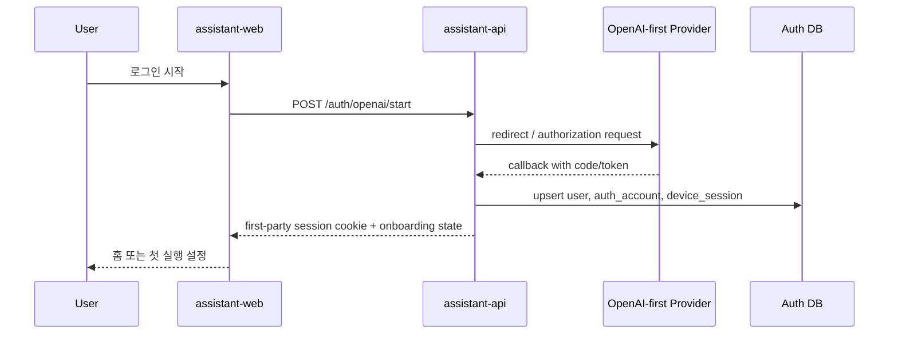
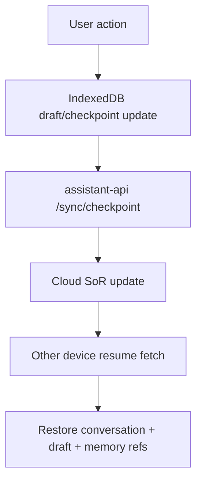

# S02 Data Auth Memory Plan

## 1. 목적

이 문서는 `GPT OAuth(OpenAI-first)`, 메모리 저장소, 로컬 캐시, 크로스디바이스 이어쓰기의 책임 경계를 데이터 흐름 관점에서 고정한다.

이번 세션의 결론은 아래와 같다.

1. 로그인은 provider-first여도 앱 세션은 first-party로 소유한다.
2. 메모리의 system of record는 클라우드 데이터베이스다.
3. 로컬 캐시는 PWA 성능과 이어쓰기를 위한 보조 계층이다.
4. 삭제와 내보내기는 MVP의 필수 경로다.

## 2. 인증 구조

### 2.1 설계 원칙

1. 제품 언어는 `GPT OAuth(OpenAI-first)`를 유지한다.
2. 시스템 구현은 `OpenAI-first provider adapter + assistant-api owned session` 구조로 만든다.
3. provider access token은 서버에만 저장하고 브라우저에는 내려주지 않는다.
4. provider capability가 변해도 내부 사용자 ID, 메모리, 체크포인트는 유지돼야 한다.

### 2.2 인증 흐름

### 2.3 구조 해석

| 계층 | 저장하는 것 | 저장하지 않는 것 |
|---|---|---|
| 브라우저 | session presence, device id, UI draft/cache | provider secret, 장기 refresh token |
| `assistant-api` | internal user/session, encrypted provider token, scope, audit metadata | 브라우저 UI 캐시 |
| provider adapter | token exchange, scope validation | 사용자 메모리, 앱 세션 상태 |

### 2.4 S04에서 검증할 항목

1. OpenAI 계정 연결의 실제 provider capability
2. 필요한 scope와 사용자 동의 화면
3. callback 이후 사용자 식별 정보 최소 세트
4. provider 실패 시 복구 경로를 제품 경험 안에서 어떻게 보일지

## 3. 핵심 데이터 모델

| 엔터티 | 목적 | 핵심 필드 |
|---|---|---|
| `user` | 제품 내부 사용자 정체성 | `id`, `created_at`, `status`, `display_name` |
| `auth_account` | provider 연결 상태 | `user_id`, `provider`, `provider_subject`, `scope`, `token_ref`, `last_refresh_at` |
| `device_session` | 기기 단위 세션 추적 | `id`, `user_id`, `device_label`, `platform`, `last_seen_at` |
| `conversation` | 대화 스레드 | `id`, `user_id`, `title`, `status`, `last_message_at` |
| `message` | 대화 메시지 | `id`, `conversation_id`, `role`, `content`, `token_usage`, `created_at` |
| `memory_item` | 사용자가 통제하는 장기 기억 | `id`, `user_id`, `kind`, `content`, `status`, `importance`, `source_type` |
| `memory_revision` | 메모리 변경 이력 | `memory_id`, `version`, `action`, `diff`, `actor`, `created_at` |
| `memory_source` | 메모리 출처와 연결 근거 | `memory_id`, `conversation_id`, `message_id`, `note`, `captured_at` |
| `session_checkpoint` | 크로스디바이스 이어쓰기 단위 | `user_id`, `conversation_id`, `last_message_id`, `draft_text`, `selected_memory_ids`, `route`, `updated_at` |
| `evidence_ref` | 사용자 UI와 release evidence 연결 | `app_version`, `bundle_id`, `summary_url`, `created_at` |

## 4. 메모리 상태 모델

### 4.1 메모리 상태

| 상태 | 의미 | 검색 반영 |
|---|---|---|
| `candidate` | 자동 저장 후보, 아직 승인 전 | 기본 검색 제외 |
| `active` | 사용 가능한 메모리 | 검색 포함 |
| `archived` | 보관 상태, 자동 활용 제외 | 수동 조회만 |
| `deleted` | 사용자 삭제 요청 반영 완료 | 검색 완전 제외 |

### 4.2 저장 규칙

1. MVP 기본값은 `명시 저장`이다.
2. 자동 추천은 `candidate`로만 생성하고, 사용자 승인 전에는 모델 프롬프트에 넣지 않는다.
3. 메모리에는 반드시 출처(`memory_source`)를 남긴다.
4. 메모리 수정/삭제는 항상 revision log를 남긴다.

### 4.3 CRUD 흐름

1. 저장: 현재 대화, 수동 입력, 설정 화면에서 생성 가능
2. 조회: 검색/필터/최근 변경 기준으로 조회
3. 수정: 내용, 중요도, 상태, 태그 변경 가능
4. 삭제: 즉시 retrieval set에서 제외하고 purge 작업을 예약
5. 내보내기: 사용자별 JSON 또는 NDJSON 번들 생성

## 5. system of record와 캐시

### 5.1 저장 계층 결정

| 계층 | 역할 | 선택 이유 |
|---|---|---|
| Cloud Postgres/pgvector | 사용자/메모리/대화/checkpoint의 system of record | CRUD, 검색, sync, 감사 이력을 한 곳에 모으기 쉬움 |
| Object Storage | export 파일, 추후 첨부파일, evidence 링크 저장 | 큰 payload와 다운로드 경로 분리 |
| IndexedDB | 최근 대화, draft, 메모리 요약, 마지막 checkpoint 캐시 | PWA와 모바일 브라우저 환경에서 가장 현실적인 로컬 저장소 |

### 5.2 캐시 규칙

1. `IndexedDB`는 성능용 보조 계층이다.
2. 충돌 시 서버 `updated_at`과 `version`이 우선한다.
3. provider token과 완전한 export 파일은 로컬 캐시에 두지 않는다.
4. 최근 1개 활성 conversation과 메모리 요약만 기본 캐시한다.

## 6. 크로스디바이스 이어쓰기

### 6.1 최소 동기화 단위

`session_checkpoint`를 크로스디바이스의 최소 동기화 단위로 본다.

이 오브젝트에는 아래가 함께 들어간다.

1. 어느 대화를 이어쓰는지: `conversation_id`
2. 어디까지 읽었는지: `last_message_id`
3. 지금 무엇을 쓰고 있었는지: `draft_text`
4. 어떤 기억을 붙잡고 있었는지: `selected_memory_ids`
5. 어떤 화면에 있었는지: `route`

### 6.2 동기화 전략

### 6.3 충돌 처리

1. checkpoint는 `last_write_wins`를 기본으로 한다.
2. 메모리 자체는 versioned update를 사용한다.
3. 사용자가 다른 기기에서 더 최신 draft를 열면 overwrite 안내를 보여준다.
4. 충돌이 있더라도 삭제된 메모리가 다시 활성화되면 안 된다.

## 7. 삭제, 내보내기, 감사

### 7.1 삭제 정책

1. 사용자 삭제 요청 직후 해당 메모리는 retrieval set에서 제외한다.
2. 서버에서는 `deleted_at`을 기록하고 purge 작업을 예약한다.
3. purge 완료 전에도 사용자 화면에는 이미 삭제된 것으로 보여야 한다.
4. backup 보존 정책은 별도 운영 문서로 분리하되, 사용자-facing 설명은 반드시 남긴다.

### 7.2 내보내기 정책

1. 내보내기는 메모리뿐 아니라 출처와 수정 이력을 함께 제공한다.
2. 기본 포맷은 `JSON` 또는 `NDJSON` 번들이다.
3. 생성된 export는 만료 시간과 다운로드 횟수 제한을 둔다.

### 7.3 사용자 신뢰 표면

사용자 설정 또는 메모리 상세 화면에는 아래가 보여야 한다.

1. 이 메모리가 언제 저장됐는지
2. 어떤 대화나 수동 입력에서 왔는지
3. 마지막으로 언제 수정됐는지
4. 삭제와 내보내기 경로가 어디인지

## 8. 사용자 표면과 품질 evidence 연결

메모리와 인증은 단독 기능으로 끝나지 않는다. `03_WIN_RUBRIC.md` 기준을 충족하려면 아래 연결이 필요하다.

1. 사용자 화면에는 `최근 변경`, `메모리 통제 경로`, `앱 버전별 evidence 링크`가 노출돼야 한다.
2. `assistant-api`는 현재 배포 버전에 매핑된 `evidence_ref`를 제공해야 한다.
3. `Ralph Loop`는 제품 UI가 읽을 수 있는 최소 summary schema를 제공해야 한다.

## 9. S04 구현 순서

| 순서 | 범위 | 최소 결과 |
|---|---|---|
| 1 | `packages/contracts` | auth, conversation, memory, checkpoint, evidence schema 초안 |
| 2 | `services/assistant-api` | auth start/callback, session middleware, memory CRUD skeleton |
| 3 | 저장소 | user/auth/memory/checkpoint migration 초안 |
| 4 | sync | checkpoint read/write API |
| 5 | export/delete | delete workflow, export job skeleton |

## 10. 아직 미정인 항목

1. OpenAI-first provider가 제공하는 실제 identity claim 범위
2. 자동 메모리 추천의 구체 기준과 사용자 opt-in 강도
3. pgvector만으로 충분한지, 별도 retrieval 계층이 필요한지
4. 음성/첨부파일을 위한 별도 object schema를 MVP 전에 열어둘지
