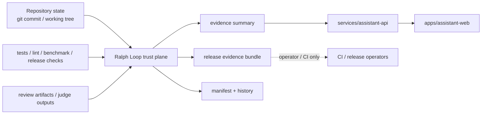

# S03 Ralph Loop Trust Model

## 1. 목적

이 문서는 `Ralph Loop`를 사용자 제품 밖의 `evidence-based trust plane`으로 재정의하고, `assistant-api`와 사용자 UI가 소비할 최소 계약을 고정한다.

이번 세션의 핵심 결론은 아래 4가지다.

1. `Ralph Loop`의 1차 산출물은 `점수`가 아니라 `release evidence bundle`이다.
2. 점수는 오직 계산 가능한 evidence에서만 파생되고, 서술형 리뷰는 보조 설명으로 분리한다.
3. 사용자 런타임은 raw artifact를 직접 읽지 않고 `evidence_summary`만 읽는다.
4. S04는 이 문서의 계약을 `packages/evidence-contracts`, `packages/contracts`, `assistant-api` endpoint로 옮기는 세션이다.

## 2. 재정의: Ralph Loop는 무엇인가

기존 `Ralph Loop`는 사실상 `scan + review + e2e + score` 스크립트 묶음에 가까웠다. S03 이후의 정의는 아래와 같다.

- 기존 정의: 코드를 점수화하고 액션플랜을 출력하는 내부 품질 루프
- 새 정의: 릴리즈 단위로 evidence를 수집하고, 무결성을 검증하고, 사용자와 운영자가 읽을 수 있는 trust summary를 발행하는 평면

즉, `Ralph Loop`는 사용자 요청 경로의 일부가 아니다. 사용자가 채팅을 보낼 때 동기 호출되는 엔진이 아니라, 현재 배포본이 어떤 증거 위에 서 있는지 보여주는 `release trust system`이다.

## 3. 경계와 연결점



### 해석

1. `assistant-web`과 `assistant-api`는 `Ralph Loop`를 실행하지 않는다.
2. 제품 표면은 `summary`와 `evidence_ref`만 읽는다.
3. raw artifact, 세부 리뷰 텍스트, 내부 로그, 절대 경로는 운영자/CI 평면에 남긴다.
4. `KG MCP`는 코드·지식 검색 평면이고, `Ralph Loop`는 릴리즈 신뢰 평면이다.

## 4. 설계 원칙

1. `점수보다 evidence`를 우선한다.
2. 모든 stage 결과는 `computed_score`와 `status`를 분리해 저장한다.
3. manual score override는 금지하고, 사람이 쓰는 설명은 `narrative` 필드로만 남긴다.
4. stage 결과는 현재 `git_commit`, `inputs_hash`, `schema_version`과 묶이지 않으면 신뢰하지 않는다.
5. 사용자 표면에는 내부 디버그 정보 대신 해석된 신뢰 요약만 노출한다.

## 5. Trust Plane 산출물

S03 이후 `Ralph Loop`의 표준 산출물은 아래 5가지다.

| 산출물 | 목적 | 소비자 | 비고 |
|---|---|---|---|
| `stage artifact` | 개별 stage의 raw 결과 저장 | `Ralph Loop`, CI, 운영자 | 상세 evidence |
| `bundle manifest` | 한 bundle에 속한 artifact 색인 | `Ralph Loop`, CI | 최신 스냅샷 |
| `history log` | append-only 실행 이력 | 운영자, 감사 | 회차별 추적 |
| `release evidence bundle` | 릴리즈 단위의 불변 증거 묶음 | 운영자, 감사 | 배포 단위 |
| `evidence summary` | 제품/UI용 요약 계약 | `assistant-api`, `assistant-web` | 사용자 노출 가능 |

## 6. Stage Contract

### 6.1 표준 stage

| Stage ID | 현재 책임 | 현재 근거 코드 | 향후 방향 |
|---|---|---|---|
| `machine_gates` | lint, forbidden scan, import smoke, 환경 점검 | `scripts/ralphloop/run.py` | score보다 blocker 성격 강화 |
| `quality_review` | 체크리스트 기반 리뷰 결과 수집 | `scripts/ralphloop/self_review.py` | `computed_score`만 점수 반영, narrative 분리 |
| `e2e_validation` | benchmark, pytest, lint, smoke를 묶은 기능 검증 | `scripts/ralphloop/e2e/t3_benchmark.py` | participation floor 제거, metric 비례 점수화 |
| `release_readiness` | 릴리즈 문서/메타 요건 검증 | `scripts/ralphloop/run.py`, `loop_runner.py` | file existence가 아닌 semantic check로 강화 |

### 6.2 stage 상태값

모든 stage는 아래 enum 중 하나를 가져야 한다.

| 값 | 의미 |
|---|---|
| `not_run` | 아직 실행되지 않음 |
| `running` | 실행 중 |
| `pass` | 기준 충족 |
| `warn` | 통과는 아니지만 bundle 생성은 가능 |
| `fail` | 기준 미달 |
| `blocked` | 선행 조건이 없어 평가 불가 |
| `invalid` | schema/hash/metadata 불일치 |
| `stale` | 현재 릴리즈 기준과 맞지 않는 오래된 artifact |

### 6.3 stage 결과 공통 필드

각 stage result는 아래 필드를 공통으로 가져야 한다.

```json
{
  "schema_version": "0.1.0",
  "artifact_kind": "stage_result",
  "artifact_id": "stage_quality_review_20260309T120000Z",
  "bundle_id": "bundle_20260309T120500Z_abc1234",
  "run_id": "run_20260309T120000Z",
  "stage_id": "quality_review",
  "status": "warn",
  "computed_score": 14,
  "max_score": 20,
  "judge_mode": "self_checklist",
  "narrative": "Critical issues remain in security and testing.",
  "inputs_hash": "sha256:...",
  "content_hash": "sha256:...",
  "git_commit": "abc1234",
  "git_tree_state": "dirty",
  "started_at": "2026-03-09T12:00:00Z",
  "completed_at": "2026-03-09T12:04:13Z",
  "warnings": [],
  "blockers": [
    "manual_score_override_detected"
  ],
  "artifact_refs": [
    "artifacts/reviews/review_security.json"
  ]
}
```

### 6.4 stage 계약 규칙

1. 점수 반영 필드는 `computed_score` 하나뿐이다.
2. `narrative`, `summary`, `recommendations`는 설명용이며 총점 계산에 직접 참여하지 않는다.
3. `git_commit`, `inputs_hash`, `schema_version`이 없으면 `invalid` 처리한다.
4. 현재 릴리즈 commit과 다르면 `stale` 처리한다.
5. `blocked`, `invalid`, `stale`는 사용자 UI에서 모두 `검증 불충분`으로 번역한다.

## 7. Artifact Metadata Contract

현재 코드에서 확인된 문제는 아래와 같다.

1. `self_review.py`는 checklist로 계산한 점수를 explicit `score`로 덮어쓸 수 있다.
2. `run.py`, `loop_runner.py`, `orchestrator.py`에 산식이 분산되어 있다.
3. `e2e_score.json`, `orchestrator_log.json`, `review_*.json`은 bundle metadata 없이 느슨하게 놓여 있다.
4. 현재 artifact는 `git_commit`, `inputs_hash`, `content_hash`, `stage_status`가 일관되게 붙지 않는다.

따라서 S03의 고정 계약은 아래와 같다.

| 필드 | 필수 여부 | 의미 |
|---|---|---|
| `schema_version` | Required | artifact schema 버전 |
| `artifact_kind` | Required | `stage_result`, `summary`, `manifest`, `history_event` 등 |
| `artifact_id` | Required | artifact 고유 ID |
| `bundle_id` | Required | 같은 release evidence bundle 소속 여부 |
| `run_id` | Required | 같은 실행 단위 소속 여부 |
| `git_commit` | Required | 평가 대상 commit |
| `git_tree_state` | Required | `clean` 또는 `dirty` |
| `inputs_hash` | Required | 입력 집합 해시 |
| `content_hash` | Required | artifact 본문 해시 |
| `created_at` | Required | 생성 시각 |
| `producer` | Required | 생성 주체 (`run.py`, `self_review.py`, judge, CI 등) |
| `visibility` | Required | `internal`, `operator`, `public_summary` |
| `status` | Required | artifact 자체 상태 |

### write 규칙

1. 모든 JSON artifact는 `temp file -> fsync -> rename` 순서로 기록한다.
2. 새 artifact가 생기면 manifest snapshot과 history event를 함께 갱신한다.
3. 이미 기록된 bundle artifact는 덮어쓰지 않고 새 artifact_id를 만든다.
4. summary는 raw artifact를 요약한 파생 산출물이며 독립 해시를 가진다.

## 8. Manifest / History Contract

### 8.1 권장 디렉터리 구조

```text
artifacts/
├── bundles/
│   └── bundle_20260309T120500Z_abc1234/
│       ├── manifest.json
│       ├── summary.json
│       ├── stage_machine_gates.json
│       ├── stage_quality_review.json
│       ├── stage_e2e_validation.json
│       └── stage_release_readiness.json
├── history.jsonl
└── latest.json
```

### 8.2 manifest 역할

`manifest.json`은 한 bundle의 최신 완결 상태를 설명하는 스냅샷이다.

```json
{
  "schema_version": "0.1.0",
  "artifact_kind": "bundle_manifest",
  "bundle_id": "bundle_20260309T120500Z_abc1234",
  "app_version": "0.4.0-alpha.1",
  "release_channel": "internal",
  "git_commit": "abc1234",
  "git_tree_state": "dirty",
  "overall_status": "warn",
  "stage_order": [
    "machine_gates",
    "quality_review",
    "e2e_validation",
    "release_readiness"
  ],
  "stage_artifacts": {
    "machine_gates": "stage_machine_gates.json",
    "quality_review": "stage_quality_review.json",
    "e2e_validation": "stage_e2e_validation.json",
    "release_readiness": "stage_release_readiness.json"
  },
  "summary_artifact": "summary.json",
  "created_at": "2026-03-09T12:05:00Z"
}
```

### 8.3 history 역할

`history.jsonl`은 append-only 감사 로그다. 각 라인은 아래 이벤트 중 하나를 기록한다.

- `run_started`
- `stage_completed`
- `bundle_published`
- `bundle_invalidated`
- `summary_exported`

history는 점수의 최신값보다 `어떤 evidence 위에서 그 값이 나왔는지`를 보여주는 용도다.

## 9. Score Integrity Rules

### 9.1 공통 원칙

1. 총점은 편의 지표일 뿐이며 `overall_status`를 대체하지 못한다.
2. `overall_status`는 `score`, `critical blocker`, `stale/invalid 여부`, `필수 stage 존재 여부`를 함께 본다.
3. stage가 누락되거나 `invalid`이면 high score여도 release candidate로 간주하지 않는다.

### 9.2 Stage 2 규칙

현재 `self_review.py`에는 아래 취약점이 있다.

- checklist 기반 계산 후 explicit `score` 필드로 override 가능

S03에서 고정하는 규칙은 아래와 같다.

1. `quality_review` stage 점수는 checklist status에서 계산한 `computed_score`만 사용한다.
2. explicit `score` 입력은 허용하지 않는다.
3. 외부 judge가 들어오더라도 별도 artifact로 기록하고 `judge_mode`를 바꿔 추적한다.
4. `critical` 또는 `high` 이슈 수는 cap 또는 blocker 정책에만 사용하고, 서술형 summary와 분리한다.

### 9.3 Stage 3 규칙

현재 `t3_benchmark.py`는 부분 점수를 관대하게 주는 구조가 남아 있다. S03의 계약은 아래다.

1. benchmark 성능은 participation bonus가 아니라 metric 비례 점수로 간다.
2. `recall == 0`이면 benchmark 점수는 0점이다.
3. `No tests collected`, `pytest skip로 인한 실질 미검증`, stale e2e 결과는 `fail` 또는 `invalid`로 처리한다.

### 9.4 Stage 4 규칙

1. `README`, `CHANGELOG`, `LICENSE`, `SECURITY`, PR template은 존재만으로 통과시키지 않는다.
2. 최소 섹션, 최소 byte, 형식 검증을 거친 뒤 `pass/warn/fail`을 결정한다.
3. 릴리즈 evidence bundle 자체가 없으면 `release_readiness`는 `blocked`다.

## 10. Evidence Summary Contract

사용자 제품이 읽는 계약은 raw score file이 아니라 아래 `evidence_summary`다.

### 10.1 목적

1. `assistant-api`가 현재 배포본의 신뢰 상태를 한 번에 읽을 수 있어야 한다.
2. `assistant-web`이 설정/정보 화면에서 사람 친화적 설명을 보여줄 수 있어야 한다.
3. 내부 절대 경로, prompt 원문, 상세 리뷰 로그를 노출하지 않아야 한다.

### 10.2 summary 필드

```json
{
  "schema_version": "0.1.0",
  "artifact_kind": "evidence_summary",
  "bundle_id": "bundle_20260309T120500Z_abc1234",
  "app_version": "0.4.0-alpha.1",
  "release_channel": "internal",
  "generated_at": "2026-03-09T12:05:00Z",
  "git_commit": "abc1234",
  "overall_status": "warn",
  "trust_label": "Evidence incomplete",
  "score": {
    "total": 68,
    "max": 100
  },
  "stage_statuses": [
    {
      "stage_id": "machine_gates",
      "status": "pass",
      "computed_score": 30,
      "max_score": 30
    },
    {
      "stage_id": "quality_review",
      "status": "warn",
      "computed_score": 18,
      "max_score": 30
    },
    {
      "stage_id": "e2e_validation",
      "status": "pass",
      "computed_score": 20,
      "max_score": 20
    },
    {
      "stage_id": "release_readiness",
      "status": "fail",
      "computed_score": 0,
      "max_score": 20
    }
  ],
  "highlights": [
    "Machine gates and E2E validation passed.",
    "Release readiness failed because semantic release docs are incomplete."
  ],
  "user_visible_controls": {
    "memory_export_supported": true,
    "memory_delete_supported": true,
    "latest_change_log_url": "/changelog",
    "evidence_detail_url": "/trust/evidence/bundle_20260309T120500Z_abc1234"
  },
  "public_evidence_links": [
    {
      "label": "Quality report",
      "url": "/trust/evidence/bundle_20260309T120500Z_abc1234"
    }
  ]
}
```

### 10.3 summary 해석 규칙

1. 사용자 UI는 `trust_label`, `highlights`, `public_evidence_links`를 우선 사용한다.
2. 세부 score는 정보 화면에서만 보이고, 핵심 UX 경로에서 과도하게 강조하지 않는다.
3. `overall_status`가 `warn`, `fail`, `invalid`, `stale`이면 UI는 이를 `검증 중`, `검증 실패`, `오래된 증거` 같은 사람이 읽는 문장으로 번역한다.
4. `assistant-api`는 version lookup 결과가 없으면 `evidence unavailable` 상태를 반환해야 한다.

## 11. assistant-api 연결 계약

S02의 `evidence_ref`를 S03 기준으로 구체화하면 아래와 같다.

| 필드 | 의미 |
|---|---|
| `app_version` | 현재 배포 앱 버전 |
| `bundle_id` | 매핑된 evidence bundle |
| `summary_ref` | summary artifact 위치 |
| `overall_status` | 현재 공개 trust 상태 |
| `generated_at` | summary 생성 시각 |

최소 읽기 인터페이스는 아래 두 가지면 충분하다.

1. `GET /v1/trust/current`
2. `GET /v1/trust/bundles/:bundleId`

첫 endpoint는 현재 배포본 summary만 반환하고, 두 번째 endpoint는 설정/정보 화면용 상세 summary를 반환한다. raw internal artifact는 이 API에서 직접 노출하지 않는다.

## 12. S04 우선순위

### P0

1. `packages/evidence-contracts`에 `stage-result`, `bundle-manifest`, `evidence-summary` schema 초안을 만든다.
2. `self_review.py`의 manual score override를 제거한다.
3. `io.py` 또는 동등한 모듈에 atomic write, hashing, latest bundle resolution을 만든다.
4. `assistant-api`가 읽을 `evidence_ref` 저장 형식과 read endpoint를 정한다.

### P1

1. `scoring.py`로 stage 산식을 단일화한다.
2. `release_readiness`를 semantic validation 기반으로 바꾼다.
3. stale artifact 검증과 `overall_status` 계산 함수를 추가한다.

### P2

1. external judge 도입 시 `judge_mode=external_llm` 경로를 추가한다.
2. public summary와 operator-only detail의 분리 저장 정책을 만든다.

## 13. 아직 남겨두는 질문

1. Stage 2의 최종 외부 judge를 어떤 모델/도구 체인으로 고정할지
2. evidence bundle을 git tracked artifact로 둘지, CI artifact/object storage로 분리할지
3. 사용자 표면에 numeric score를 그대로 보여줄지, badge/label 중심으로 번역할지
4. 공개 summary에서 benchmark 세부값과 리뷰 세부 이슈를 어느 수준까지 노출할지
