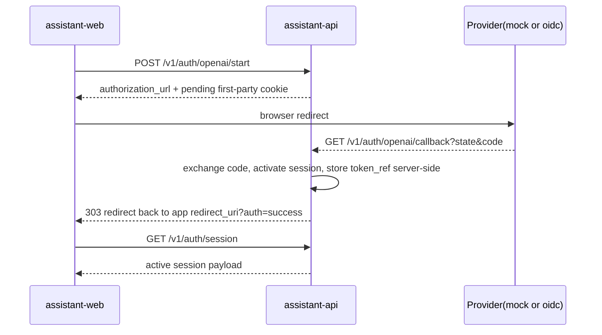

# S06 Assistant Web Shell

## 1. 목적

`apps/assistant-web`를 `assistant-api`와 실제로 연결되는 첫 사용자 표면으로 만든다.

이번 산출물은 아래 4가지를 동시에 만족해야 한다.

1. 로그인 시작점이 실제 `assistant-api` auth start route를 호출한다.
2. provider callback 이후 다시 `assistant-web`로 돌아오는 경로가 존재한다.
3. 메모리, checkpoint, trust surface가 contract shape 그대로 렌더링된다.
4. 모바일 폭에서도 핵심 흐름이 무너지지 않는다.

## 2. 구현 형태

현재 저장소에는 JS workspace, 번들러, shared UI 패키지가 아직 없다.

그래서 S06의 첫 shell은 아래 원칙으로 구현했다.

1. `apps/assistant-web`는 no-build static app으로 시작한다.
2. 브라우저 표면은 `index.html + app.js + styles.css` 조합으로 유지한다.
3. PWA 최소 요건으로 `manifest.webmanifest`, `service-worker.js`, `icon.svg`를 둔다.
4. 데이터 캐시는 `IndexedDB`에 `session`, `memory`, `checkpoint`, `trust` snapshot만 저장한다.

이 선택의 이유는 아직 워크스페이스가 없는 상태에서 shell contract 검증을 가장 빠르게 끝내기 위해서다.

## 3. 파일 구조

```text
apps/assistant-web/
├── README.md
├── index.html
├── app.js
├── styles.css
├── manifest.webmanifest
├── service-worker.js
└── icon.svg
```

## 4. auth round trip



### 구현 메모

1. `assistant-api`는 start 단계에서 `auth_flow` row를 만든다.
2. `auth_flow`는 `oauth_state`, `redirect_uri`, `code_verifier`, `code_challenge`, `expires_at`를 저장한다.
3. callback route는 stored `redirect_uri`로만 다시 돌려보낸다.
4. shell은 callback query만 읽고, 실제 세션 상태는 항상 `GET /v1/auth/session`으로 재확인한다.

## 5. provider mode

### `mock`

- 기본 bootstrap 모드
- `assistant-api` 내부 `mock authorize` route가 callback까지 되돌린다
- 외부 provider credential 없이 로컬 end-to-end 검증이 가능하다

### `oidc`

- 표준 authorization code + PKCE 경로
- `ASSISTANT_API_PROVIDER_*` env로 authorization, token, userinfo endpoint를 주입한다
- `id_token` claim 또는 `userinfo` payload에서 `provider_subject`를 해석한다

## 6. shell surface

### Session Ledger

- 현재 first-party session 상태
- provider subject, scope, expiry, last seen
- `pending_consent` 또는 `reauth_required` 상태를 직접 노출

### Resume Capsule

- `session_checkpoint` upsert/read
- conversation id, last message id, route, draft text 편집
- 선택된 memory id를 함께 저장
- local draft, latest server copy, conflict state를 분리해 복구 UX를 제공

### Memory Atelier

- 명시 저장형 memory create
- archive/delete control
- export/download control
- `memory_source` provenance note를 함께 저장하고 렌더링
- kind, importance, source type, provenance, updated timestamp를 사용자 표면에 노출

### Trust Surface

- `GET /v1/trust/current` 결과만 표시
- `bundle_id`, `trust_label`, `score`, `stage_statuses`, `public_evidence_links`
- raw Ralph Loop artifact path와 내부 로그는 숨긴다

## 7. 캐시 정책

1. shell은 live fetch 전에 IndexedDB snapshot을 먼저 hydrate한다.
2. checkpoint는 `server copy`와 `local dirty draft`를 분리해 저장한다.
3. session이 `active`가 아니면 memory/checkpoint live fetch는 막는다.
4. server checkpoint가 더 새로우면 conflict banner를 띄우고 `Use Server Copy` 또는 `Keep Local Draft`를 고르게 한다.

## 8. 아직 남은 것

1. real OpenAI-compatible provider credentials로 live capability를 검증한 것은 아니다.
2. export retention과 실제 purge execution은 아직 bootstrap queue/table 수준이다.
3. repeatable browser smoke는 `python3 scripts/assistant/run_browser_smoke.py`로 추가됐지만, 더 넓은 CI-grade browser suite는 아직 없다.
