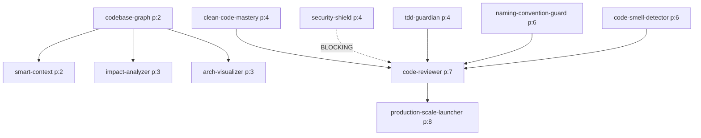

# Skill Registry v4.0

## Included Skills (2)

These skills are included in this package:

| Skill | Layer | Description |
|-------|-------|-------------|
| **clean-code-mastery** | Quality | SOLID/DRY/KISS enforcement + OWASP security patterns |
| **vibe-coding-orchestrator** | Integration | Orchestrates all skills with dependency-aware execution |

## Compatible Skills (16)

These skills can be installed separately and the orchestrator will detect and coordinate them:

```yaml
skills:
  # === Foundation Layer (priority 0-1) ===
  codebase-graph:
    priority: 2
    layer: foundation
    description: "Ontology-based code knowledge graph. Analyzes codebase structure."
    depends_on: []
    status: available_separately

  smart-context:
    priority: 2
    layer: foundation
    description: "Token-efficient context extraction. 6 detail levels."
    depends_on: [codebase-graph]
    status: available_separately

  # === Context Layer (priority 0) ===
  context-architect:
    priority: 0
    layer: context
    description: "Structures CLAUDE.md, PLAN.md, PROGRESS.md, AGENTS.md for optimal AI performance."
    depends_on: []
    status: planned

  # === Planning Layer (priority 1) ===
  project-architect:
    priority: 1
    layer: planning
    description: "Project structure design with layer separation and modularization."
    depends_on: []
    status: available_separately

  tech-stack-advisor:
    priority: 1
    layer: planning
    description: "Technology stack selection guide for modern projects."
    depends_on: []
    status: available_separately

  requirements-analyzer:
    priority: 1
    layer: planning
    description: "Converts natural language ideas into technical specifications."
    depends_on: []
    status: available_separately

  # === Analysis Layer (priority 2-3) ===
  impact-analyzer:
    priority: 2
    layer: analysis
    description: "Change propagation analysis with risk scoring."
    depends_on: [codebase-graph]
    status: available_separately

  arch-visualizer:
    priority: 3
    layer: analysis
    description: "Architecture visualization with Mermaid/PlantUML diagrams."
    depends_on: [codebase-graph]
    status: available_separately

  # === Quality Layer (priority 4) ===
  tdd-guardian:
    priority: 4
    layer: quality
    description: "Test-driven development enforcement. Coverage gates."
    depends_on: []
    status: available_separately

  security-shield:
    priority: 4
    layer: quality
    description: "OWASP Top 10 verification. Hardcoded secret detection (40+ patterns)."
    depends_on: []
    is_blocking: true
    status: available_separately

  # === Structure Layer (priority 5) ===
  monorepo-architect:
    priority: 5
    layer: structure
    description: "Monorepo structure with dependency direction rules."
    depends_on: []
    status: available_separately

  api-first-design:
    priority: 5
    layer: structure
    description: "Contract-first API design with standard response formats."
    depends_on: []
    status: available_separately

  # === Validation Layer (priority 6) ===
  naming-convention-guard:
    priority: 6
    layer: validation
    description: "Consistent naming rules per language (camelCase, PascalCase, snake_case)."
    depends_on: []
    status: available_separately

  code-smell-detector:
    priority: 6
    layer: validation
    description: "22 code smell patterns detection with refactoring suggestions."
    depends_on: []
    status: available_separately

  dependency-sentinel:
    priority: 6
    layer: validation
    description: "Dependency health monitoring, CVE detection, update strategies."
    depends_on: []
    status: planned

  # === Integration Layer (priority 7) ===
  code-reviewer:
    priority: 7
    layer: integration
    description: "Final unified review with quality gate scoring."
    depends_on: [clean-code-mastery]
    status: available_separately

  # === Production Layer (priority 8) ===
  production-scale-launcher:
    priority: 8
    layer: production
    description: "Production readiness assessment with 4-stage maturity model."
    depends_on: []
    status: planned
```

## Dependency Graph



## Execution Order

Skills execute by priority number (low = first). Skills at the same priority level can run in parallel.

```yaml
execution_phases:
  phase_0: [context-architect, codebase-graph]    # Foundation
  phase_1: [smart-context, project-architect, tech-stack-advisor, requirements-analyzer]
  phase_2: [impact-analyzer]                       # Analysis
  phase_3: [arch-visualizer]                       # Analysis
  phase_4: [clean-code-mastery, tdd-guardian, security-shield]  # Quality (parallel)
  phase_5: [monorepo-architect, api-first-design]  # Structure
  phase_6: [naming-convention-guard, code-smell-detector, dependency-sentinel]  # Validation
  phase_7: [code-reviewer]                         # Integration
  phase_8: [production-scale-launcher]             # Production
```

## Skill Detection

The orchestrator auto-detects available skills by checking if their SKILL.md files exist:

```yaml
detection:
  method: "glob for */SKILL.md in skills directory"
  fallback: "use only included skills (clean-code-mastery)"
  notification: "inform user which compatible skills are missing"
```

---

**Version**: 4.0.0 | **Skills**: 2 included + 16 compatible
