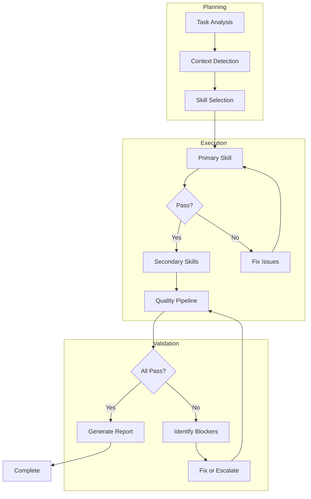

# Standard Workflow

## 표준 워크플로우



## 워크플로우 단계

### Phase 1: Planning (계획)

```typescript
interface PlanningPhase {
  taskAnalysis: {
    type: TaskType;
    scope: 'small' | 'medium' | 'large';
    estimatedComplexity: number;
  };
  contextDetection: {
    projectType: ProjectType;
    affectedFiles: string[];
    dependencies: string[];
  };
  skillSelection: {
    primary: string;
    secondary: string[];
    reasoning: string;
  };
}

async function runPlanningPhase(task: Task): Promise<PlanningPhase> {
  // 1. 작업 분석
  const taskAnalysis = analyzeTask(task);

  // 2. 컨텍스트 감지
  const contextDetection = await detectContext(task.files);

  // 3. 스킬 선택
  const skillSelection = selectSkills(taskAnalysis, contextDetection);

  return { taskAnalysis, contextDetection, skillSelection };
}
```

### Phase 2: Testing (테스트 - TDD)

```typescript
interface TestingPhase {
  existingTests: TestInfo[];
  requiredTests: TestRequirement[];
  testPlan: TestPlan;
}

async function runTestingPhase(context: WorkContext): Promise<TestingPhase> {
  // tdd-guardian 스킬 활성화
  const tddGuardian = await loadSkill('tdd-guardian');

  // 1. 기존 테스트 분석
  const existingTests = await tddGuardian.analyzeExistingTests(context);

  // 2. 필요한 테스트 식별
  const requiredTests = await tddGuardian.identifyRequiredTests(context);

  // 3. 테스트 계획 생성
  const testPlan = await tddGuardian.createTestPlan(existingTests, requiredTests);

  return { existingTests, requiredTests, testPlan };
}
```

### Phase 3: Implementation (구현)

```typescript
interface ImplementationPhase {
  codeQuality: QualityResult;
  securityCheck: SecurityResult;
  suggestions: Suggestion[];
}

async function runImplementationPhase(
  context: WorkContext,
  code: string
): Promise<ImplementationPhase> {
  // clean-code-mastery + security-shield 병렬 실행
  const [codeQuality, securityCheck] = await Promise.all([
    loadSkill('clean-code-mastery').then(s => s.analyze(code)),
    loadSkill('security-shield').then(s => s.scan(code)),
  ]);

  // 개선 제안 통합
  const suggestions = mergeSuggestions(
    codeQuality.suggestions,
    securityCheck.recommendations
  );

  return { codeQuality, securityCheck, suggestions };
}
```

### Phase 4: Review (리뷰)

```typescript
interface ReviewPhase {
  reviewResult: ReviewResult;
  score: number;
  verdict: 'approved' | 'changes_requested' | 'blocked';
}

async function runReviewPhase(context: WorkContext): Promise<ReviewPhase> {
  // code-reviewer 스킬 활성화 (모든 스킬 통합)
  const codeReviewer = await loadSkill('code-reviewer');

  const reviewResult = await codeReviewer.review(context);

  const verdict =
    reviewResult.score >= 90 ? 'approved' :
    reviewResult.score >= 70 ? 'changes_requested' :
    'blocked';

  return {
    reviewResult,
    score: reviewResult.score,
    verdict,
  };
}
```

### Phase 5: Documentation (문서화)

```typescript
interface DocumentationPhase {
  apiDocs: ApiDocumentation;
  changelog: ChangelogEntry;
  updatedReadme: boolean;
}

async function runDocumentationPhase(
  context: WorkContext
): Promise<DocumentationPhase> {
  // api-first-design 스킬 활성화
  const apiFirstDesign = await loadSkill('api-first-design');

  // API 문서 업데이트
  const apiDocs = await apiFirstDesign.generateDocs(context);

  // 변경 로그 생성
  const changelog = generateChangelog(context.change);

  // README 업데이트 필요 여부
  const updatedReadme = await checkReadmeUpdate(context);

  return { apiDocs, changelog, updatedReadme };
}
```

## 워크플로우 실행

```typescript
async function executeWorkflow(task: Task): Promise<WorkflowResult> {
  const results: WorkflowResult = {
    phases: [],
    overallStatus: 'pending',
    duration: 0,
  };

  const startTime = Date.now();

  try {
    // Phase 1: Planning
    results.phases.push({
      name: 'Planning',
      result: await runPlanningPhase(task),
      status: 'completed',
    });

    // Phase 2: Testing
    results.phases.push({
      name: 'Testing',
      result: await runTestingPhase(task.context),
      status: 'completed',
    });

    // Phase 3: Implementation
    results.phases.push({
      name: 'Implementation',
      result: await runImplementationPhase(task.context, task.code),
      status: 'completed',
    });

    // Phase 4: Review
    const reviewResult = await runReviewPhase(task.context);
    results.phases.push({
      name: 'Review',
      result: reviewResult,
      status: reviewResult.verdict === 'blocked' ? 'failed' : 'completed',
    });

    if (reviewResult.verdict === 'blocked') {
      results.overallStatus = 'blocked';
      return results;
    }

    // Phase 5: Documentation
    results.phases.push({
      name: 'Documentation',
      result: await runDocumentationPhase(task.context),
      status: 'completed',
    });

    results.overallStatus = 'completed';
  } catch (error) {
    results.overallStatus = 'error';
    results.error = error.message;
  }

  results.duration = Date.now() - startTime;
  return results;
}
```

## 워크플로우 커스터마이징

```yaml
Workflow_Presets:
  quick:
    description: "빠른 검토 (작은 변경)"
    phases: [Implementation, Review]
    skip: [Testing, Documentation]

  standard:
    description: "표준 워크플로우"
    phases: [Planning, Testing, Implementation, Review, Documentation]

  security-focused:
    description: "보안 중심 (민감한 코드)"
    phases: [Planning, Implementation, Review]
    emphasis: [security-shield]
    extra_checks: [penetration-test, dependency-audit]

  tdd-strict:
    description: "TDD 엄격 모드"
    phases: [Testing, Implementation, Testing, Review]
    requirement: "테스트 먼저 작성 필수"
```
